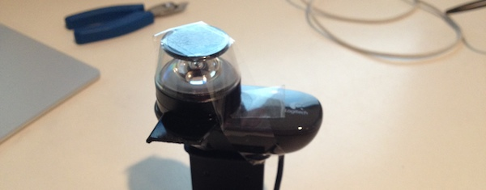
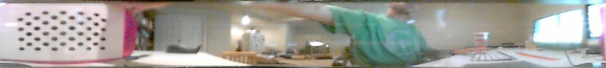

#Omni-Camera

## Goal

I wanted an 360 degree FOV camera for a mobile robot. Hoping to be able to do some interesting things with it.

## Setup

Using an iPhone [kogeto](kogeto.com/dot.html) lens to get 360 degree video, I attached it to a Logitech C290 web camera which produced 720p images.

 

Luckily the lens for a 4S was on sale for $13 so it didn't cost much. 

The unwrapping the image produced the following 1460x165 pixel image:

However, I couldn't get the OpenCV functions to find the circles during calibration and therefor not able to correct distortions. Additionally, the images appears very grainy and is most likely not entirely in focus. I expected poor performance in places where the tape was on the lens, but performance seem poor all the way around.

## Conclusion

This setup appears to not be vary useful. However, it is cool to see it work. 

